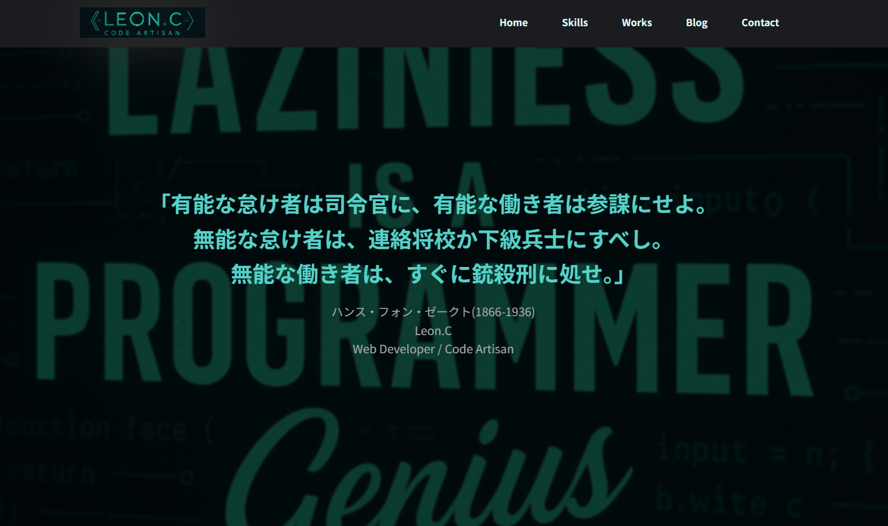

# LazyGeniusDev_WordPressTheme

🧠 A custom WordPress theme built by [Leon.C](https://lazygenius.dev), designed for clarity, speed, and total control.  
日本語名：「俺のサイトのWordPressオリジナルテーマ」

---

## ✨ 特徴（Features）

- 🛠️ カスタム投稿「制作実績」（一覧・詳細ページあり）
- 📬 お問い合わせフォーム（自作PHP＋wp_mail対応）
- 💰 固定ページに埋め込める簡易見積もりツール付き（JavaScript製）
- 🌓 ダーク系・シンプルデザイン（完全オリジナル）
- 📱 レスポンシブ対応（768px以下でスマホ最適化）
- ⚡ 軽量・SEO意識の構造化
- 🧩 モジュール化されたCSS設計（`css/` 以下）

---

## 🛠 使用技術（Tech Stack）

- HTML / CSS / JavaScript / jQuery
- PHP / WordPress（オリジナルテーマ自作）
- ※ACFプラグインは未使用

---

## 🚀 導入手順（自分用メモ）

1. 本テーマを `wp-content/themes/` に配置
2. WordPress管理画面から有効化
3. 固定ページ・カスタム投稿「制作実績」を作成
4. 必要に応じてショートコードなどを設定

---

## 🧱 固定ページテンプレート（カスタムページ）

このテーマには、以下のようなページテンプレート・カスタム構成が含まれています。

| ページ名                | 用途・説明 |
|------------------------|------------|
| `page-thanks.php`      | お問い合わせ完了後のサンクスページ |
| `page-tokushoho.php`   | 特定商取引法に基づく表記ページ |
| `simulator-template.php` | 狩猟笛シミュレーター用の専用ページテンプレート |
| `404.php`              | 独自デザインの404エラーページ |

> 📌 固定ページ作成時に「テンプレート」から選択することで、それぞれ利用可能です。

---

## 💡 その他の便利パーツ

- **簡易見積もりツール**  
  JavaScript + CSSで構成された金額算出UI。  
  サービスの選択に応じてリアルタイムで価格表示。`section-pricelist.php` で管理。

- **狩猟笛シミュレーター**  
  JSON化されたCSVデータを元に、WordPress固定ページ内で動作するWebアプリ。

> 📌 どちらも「固定ページ＋テンプレート指定」で即利用可能。  
> テーマを有効化すれば、構築の土台はすぐに整います。

---

## 🖼️ スクリーンショット

| トップページ |
|---------------|
|  |

---

<details>
<summary>📂 ディレクトリ構成（クリックで展開）</summary>

```
├── css
│   ├── base.css
│   ├── blog.css
│   ├── components.css
│   ├── layout.css
│   ├── pages.css
│   ├── responsive.css
│   ├── simulator_style.css
│   ├── single.css
│   ├── style.css
│   ├── utilities.css
│   └── variables.css
├── data
│   └── main.csv
├── icons
│   ├── css.svg
│   ├── html5.svg
│   ├── javascript.svg
│   ├── jquery.svg
│   ├── laragon.svg
│   ├── laravel.svg
│   ├── mysql.svg
│   ├── php.svg
│   ├── react.svg
│   └── wordpress.svg
├── images
│   ├── sitelogo.png
│   ├── sitelogo2.png
│   ├── chat-app.png
│   └── ...（他の画像多数）
├── js
│   ├── main.js
│   ├── estimate.js
│   └── simulator.js
├── simulator_images
│   ├── default.jpg
│   ├── huntinghorn-01.webp
│   └── ...（画像複数）
├── template-parts
│   ├── section-hero.php
│   ├── section-about.php
│   ├── section-works.php
│   ├── section-skills.php
│   ├── section-contact.php
│   ├── blog-contents.php
│   └── blog-pagination.php
├── 404.php
├── category.php
├── date.php
├── favicon.ico
├── footer.php
├── front-page.php
├── functions.php
├── header.php
├── header-simulator.php
├── home.php
├── index.php
├── mail-handler.php
├── page-thanks.php
├── page-tokushoho.php
├── screenshot.png
├── search.php
├── searchform.php
├── simulator-template.php
├── single.php
├── weapons.php
```
</details>

---

## 📄 ライセンス

このテーマは MITライセンス のもとで公開しています。

> 🔓 **要約（日本語訳）**  
> - 商用・個人問わず、自由に使ってOK  
> - 改造・再配布・販売もOK  
> - ただし、著作権表示とライセンス文は消さないでね  
> - 不具合があっても作者は責任取らないよ

詳しくは [LICENSE](./LICENSE) をご覧ください。

---

## 👤 作者

**Leon.C**  
[https://lazygenius.dev](https://lazygenius.dev)  

> 📌 このテーマは自身のポートフォリオとしても使用中。再利用・参考は自由ですが、改変時のライセンスにはご配慮ください。
